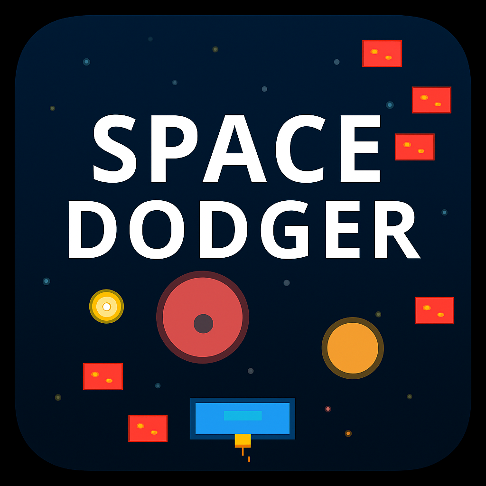

# 🚀 Space Dodger

<div align="center">



**A thrilling space adventure where you pilot a spaceship through asteroid fields, dodging danger while collecting cosmic treasures!**

[](https://flutter.dev)
[](https://dart.dev)
[](LICENSE)
[](https://flutter.dev)

</div>

## 🎮 About Space Dodger

Space Dodger is an exciting mobile game that combines classic arcade gameplay with modern mobile features. Navigate your spaceship through treacherous asteroid fields, collect valuable coins, and achieve the highest score possible while customizing your gaming experience with various settings and difficulty levels.

### 🌟 What Makes It Special

- **🎯 Intuitive Controls**: Simple left/right touch controls for smooth gameplay
- **⚡ Dynamic Difficulty**: Adjustable difficulty from 0.5x to 6.0x for all skill levels
- **💎 Smart Scoring**: Score multipliers based on difficulty and strategic choices
- **❤️ Lives System**: Multiple lives (1-3) for extended gameplay sessions
- **🎨 Beautiful Graphics**: Space-themed visuals with particle effects and smooth animations
- **🔊 Immersive Audio**: Sound effects and background music for enhanced experience
- **⚙️ Customizable Settings**: Tailor the game to your preferences

## 🎯 Game Features

### 🚀 Core Gameplay
- **Spaceship Navigation**: Control your ship with responsive touch controls
- **Asteroid Dodging**: Navigate through falling red asteroids to survive
- **Coin Collection**: Collect yellow coins to increase your score
- **Progressive Speed**: Game speed increases as your score grows
- **Lives System**: Start with 1-3 lives (configurable in settings)

### 🎛️ Advanced Features
- **Difficulty Scaling**: 0.5x to 6.0x difficulty multiplier
  - Higher difficulty = more asteroids + better scoring
  - 3x difficulty = 3 points per coin, 6x difficulty = 6 points per coin
- **Coin Magnet**: Enable to collect coins from any height
- **Magnet Bonus**: +5 points when coin magnet is OFF (skill reward)
- **Speed Control**: Adjustable game speed from 30ms to 120ms
- **Max Score Tracking**: Persistent high score tracking

### 🎨 Visual & Audio
- **Space Theme**: Beautiful cosmic graphics with detailed sprites
- **Particle Effects**: Explosions, coin collection effects, and engine trails
- **Smooth Animations**: 60 FPS gameplay with fluid movements
- **Sound Effects**: Coin collection, explosions, and game over sounds
- **Background Music**: Immersive space-themed audio

### ⚙️ Customization Options
- **Lives Selection**: Choose 1, 2, or 3 lives
- **Difficulty Slider**: Fine-tune challenge level (0.5x - 6.0x)
- **Game Speed**: Adjust base game speed for your preference
- **Coin Magnet**: Toggle automatic coin collection
- **Visual Effects**: Enable/disable particle effects
- **Sound Settings**: Control audio experience

## 📱 Screenshots

<div align="center">

```
┌─────────────────────────────────┐
│        🏆 Space Dodge 🏆       │
│                                 │
│    🚀                          │
│                                 │
│  ⭐     💥                     │
│                                 │
│     💥      ⭐                 │
│                                 │
│  [◀]        [▶]                │
│                                 │
│ Score: 150    ❤️❤️❤️           │
└─────────────────────────────────┘
```

*Gameplay with lives display and score tracking*

</div>

## 🚀 Quick Start

### Prerequisites
- **Flutter SDK**: 3.0.0 or higher
- **Dart SDK**: Latest stable version
- **Development Environment**: Android Studio, VS Code, or your preferred IDE
- **Device/Emulator**: Android device, iOS device, or emulator

### Installation

1. **Clone the repository**
   ```bash
   git clone https://github.com/yourusername/space-dodger.git
   cd space-dodger
   ```

2. **Install dependencies**
   ```bash
   flutter pub get
   ```

3. **Run the game**
   ```bash
   flutter run
   ```

### Building for Release

**Android APK:**
```bash
flutter build apk --release
```

**Android App Bundle (Recommended for Play Store):**
```bash
flutter build appbundle --release
```

**iOS App:**
```bash
flutter build ios --release
```

**Web Version:**
```bash
flutter build web --release
```

## 🎮 How to Play

### Basic Controls
- **Left Button (◀)**: Move spaceship to the left
- **Right Button (▶)**: Move spaceship to the right
- **Settings Icon (⚙️)**: Access game settings and customization
- **Pause Icon (⏸️)**: Pause/resume the game
- **Refresh Icon (🔄)**: Restart the current game

### Gameplay Rules
1. **Objective**: Collect as many coins as possible while avoiding asteroids
2. **Scoring System**:
   - Base score = difficulty multiplier × 1 point
   - Magnet bonus = +5 points when coin magnet is OFF
   - Example: 3x difficulty + magnet OFF = 8 points per coin
3. **Lives**: Start with 1-3 lives (configurable)
4. **Game Over**: Lose all lives when colliding with asteroids
5. **Progression**: Game speed increases with higher scores

### 🏆 Scoring Strategy
- **Beginner**: Start with 1.0x difficulty and coin magnet ON
- **Intermediate**: Try 2.0x-3.0x difficulty for better scoring
- **Expert**: Challenge yourself with 4.0x-6.0x difficulty and magnet OFF
- **High Score**: Combine high difficulty with magnet OFF for maximum points

## ⚙️ Game Settings Explained

### Lives System
- **1 Life**: Hardcore mode - one mistake and you're done
- **2 Lives**: Balanced challenge - room for one mistake
- **3 Lives**: Casual mode - forgiving gameplay for beginners

### Difficulty Levels
- **0.5x**: Very Easy - Few asteroids, perfect for learning
- **1.0x**: Easy - Standard gameplay
- **2.0x**: Medium - More challenging
- **3.0x**: Hard - High asteroid density
- **4.0x**: Very Hard - Intense gameplay
- **5.0x**: Extreme - Maximum challenge
- **6.0x**: Insane - Ultimate test of skill

### Game Speed
- **30ms**: Very Fast - For experienced players
- **60ms**: Fast - Standard speed
- **90ms**: Moderate - Balanced gameplay
- **120ms**: Slow - Relaxed pace for beginners

### Coin Magnet
- **ON**: Automatic coin collection from any height
- **OFF**: Manual collection only (requires precise positioning) + 5 bonus points

## 🏗️ Project Structure

```
space-dodger/
├── lib/
│   ├── main.dart                 # App entry point
│   ├── screens/
│   │   └── game_screen.dart      # Main game screen and logic
│   ├── models/
│   │   ├── game_objects.dart     # Game entities (Ship, Bomb, Coin)
│   │   └── sound_manager.dart    # Audio management
│   └── widgets/
│       ├── game_painter.dart     # Custom painting for game graphics
│       ├── settings_panel.dart   # Settings dialog widget
│       └── space_background.dart # Animated background
├── assets/
│   ├── app_icon.png             # Custom app icon
│   └── sounds/                  # Audio files
├── android/                     # Android-specific configuration
├── ios/                         # iOS-specific configuration
└── pubspec.yaml                 # Dependencies and configuration
```

## 🎨 Technical Architecture

### Core Components
- **GameScreen**: Main game controller, UI, and game loop
- **Ship**: Player-controlled spaceship with movement logic
- **Bomb**: Hazardous asteroids that must be avoided
- **Coin**: Collectible items that increase score
- **GamePainter**: Custom rendering for optimized graphics
- **SettingsPanel**: Comprehensive game configuration interface
- **SoundManager**: Audio playback and management

### Game Loop Architecture
1. **Input Processing**: Handle touch inputs and continuous movement
2. **Entity Updates**: Move ship, bombs, and coins based on game speed
3. **Collision Detection**: Check for collisions and coin collection
4. **Scoring System**: Calculate points based on difficulty and settings
5. **State Management**: Update lives, score, and game state
6. **Visual Effects**: Render particles, explosions, and animations
7. **Audio Feedback**: Play appropriate sound effects

### Performance Optimizations
- **Efficient Collision Detection**: Optimized hitbox calculations
- **Object Pooling**: Reuse game objects to minimize memory allocation
- **Custom Painting**: Direct canvas rendering for smooth 60 FPS
- **State Management**: Minimal widget rebuilds with proper state handling
- **Memory Management**: Automatic cleanup of off-screen objects

## 🔧 Development Guide

### Adding New Features
1. **New Game Objects**: Extend `game_objects.dart` with new entity classes
2. **Visual Enhancements**: Modify `game_painter.dart` for new graphics
3. **UI Improvements**: Update `game_screen.dart` or `settings_panel.dart`
4. **Game Logic**: Enhance game loop in `game_screen.dart`
5. **Audio**: Add new sounds to `sound_manager.dart`

### Code Style
- Follow Flutter/Dart best practices
- Use meaningful variable and function names
- Add comments for complex game logic
- Maintain consistent code formatting

### Testing
```bash
# Run tests
flutter test

# Run with coverage
flutter test --coverage

# Debug mode
flutter run --debug
```

## 🐛 Troubleshooting

### Common Issues

**Game won't start:**
- Ensure Flutter SDK is properly installed
- Run `flutter doctor` to check setup
- Try `flutter clean && flutter pub get`

**Performance issues:**
- Disable visual effects in settings
- Close other apps to free memory
- Use a device instead of emulator

**Touch not responding:**
- Check device/emulator connection
- Restart the app
- Verify touch input is enabled

**Build errors:**
- Update Flutter: `flutter upgrade`
- Clean project: `flutter clean`
- Reinstall dependencies: `flutter pub get`

### Debug Commands
```bash
# Check Flutter installation
flutter doctor

# Clean and rebuild
flutter clean
flutter pub get

# Run in debug mode
flutter run --debug

# Build release APK
flutter build apk --release
```

## 📄 License

This project is licensed under the MIT License - see the [LICENSE](LICENSE) file for details.

## 🤝 Contributing

We welcome contributions! Here's how you can help:

1. **Fork** the repository
2. **Create** a feature branch (`git checkout -b feature/AmazingFeature`)
3. **Commit** your changes (`git commit -m 'Add some AmazingFeature'`)
4. **Push** to the branch (`git push origin feature/AmazingFeature`)
5. **Open** a Pull Request

### Contribution Guidelines
- Follow existing code style and conventions
- Add tests for new features
- Update documentation as needed
- Ensure all tests pass before submitting

## 📞 Support & Feedback

- **GitHub Issues**: Report bugs or request features
- **Discussions**: Join community discussions
- **Email**: Contact the development team
- **Documentation**: Check this README and code comments

## 🎉 Acknowledgments

- **Flutter Team**: For the amazing framework
- **Dart Team**: For the powerful programming language
- **Flutter Community**: For excellent documentation and support
- **Game Development Community**: For inspiration and best practices
- **Beta Testers**: For valuable feedback and bug reports

## 🌟 Future Roadmap

- [ ] Multiplayer mode
- [ ] Power-ups and special abilities
- [ ] Different ship types
- [ ] Achievement system
- [ ] Leaderboards
- [ ] More visual themes
- [ ] Enhanced sound effects
- [ ] Tutorial mode

---

<div align="center">

**🚀 Ready to embark on your space adventure? Download Space Dodger now! 🚀**

*Built with ❤️ using Flutter*

[]([releases/latest](https://github.com/narendra3003/space-dodger/releases/tag/v1.0.0))

</div>
